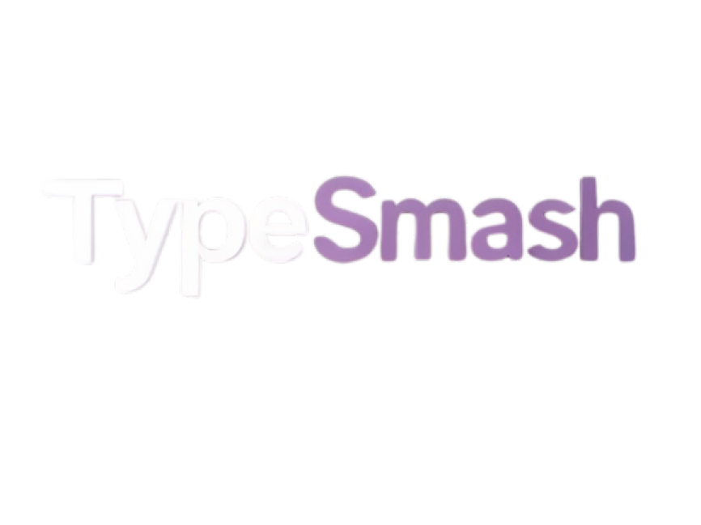
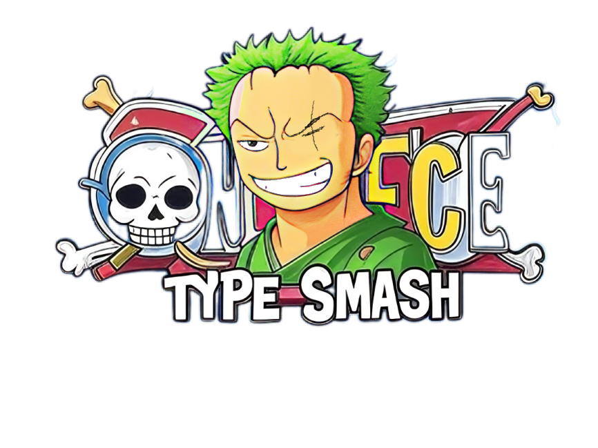

# TypeSmash 💻⌨️

A sleek, minimalist typing test that doesn't suck. Check your typing speed without the bloat.

## 🔥 What's this?
TypeSmash is a no-nonsense typing test that lets you track your speed, accuracy, and progress over time. Built with clean design principles inspired by MonkeyType but with my own twist. Perfect for:
- Practicing your typing skills
- Competing with yourself (or friends)
- Looking productive when your boss walks by

## ⚔️ Core Features

- **Clean, distraction-free UI** - Focus on typing, not flashy animations
- **Multiple test modes**:
  - Time-based: 15 second sprint
  - Word-based: Multiple word counts (20, 50, 100, 200, 500, and 1000 words)
  - Meaningful passages for word mode tests (not just random words)
- **Detailed statistics** - Track WPM, accuracy, error percentage
- **History tracking** - See your progress over time with fancy graphs
- **Dark mode by default** - Because I care about your eyes

## 🧃 How to Use

1. Go to github.com/acharya-aayush/typesmash
2. Choose your test mode (time or word count)
3. Type the words shown on screen
4. Get your results and feel good (or bad) about yourself
5. Repeat until RSI develops

## 📊 Stats & History

TypeSmash keeps track of your last 100 typing tests, showing you:
- Words per minute (WPM)
- Accuracy percentage
- Character count
- Error count
- Time elapsed

View your history as bar graphs or line charts to track your improvement over time.

## 📝 Word Mode

The word mode has been expanded to include various word counts:
- **20 words**: Quick test for a speed check
- **50 words**: Short paragraphs to build rhythm
- **100 words**: Medium-length passages
- **200 words**: Extended passages to test endurance
- **500 words**: Long-form typing challenge
- **1000 words**: Marathon typing session

All word modes feature meaningful text passages instead of random words, making the typing experience more engaging and realistic.

## ⌛ Scrapped Features

Several features were developed but ultimately removed due to scope/time constraints:

- **Extended Time Tests** - 30 and 60 second modes were fully working but removed to focus on core experience
- **Code Mode** - A specialized mode for practicing typing code in Python and JavaScript. Removed due to headaches with syntax highlighting and tab/indentation handling
- **Custom Text Mode** - Allowing users to paste their own text was abandoned due to formatting issues
- **Account System** - Login functionality to sync stats across devices (maybe someday)

## ⚙️ Tech Stack
- Plain HTML, CSS, JS (kept it simple)
- LocalStorage for data persistence
- Canvas for stats visualization
- No frameworks because I'm a purist (or lazy, take your pick)

## 📱 Mobile Support
Currently optimized for desktop. Mobile support is planned but not implemented because typing on phones is painful anyway.

## 🗡️ Oh, and there's Zoro Mode... (last minute addition)

A completely unplanned feature added in the final days of development. Words fall from the top of the screen, and you type them before they hit the bottom. Inspired by One Piece, because why not.

### Difficulty Tiers in Zoro Mode:
- **East Blue** – 3-letter baby words for beginners
- **Paradise** – 4-6 letter words to test your skills
- **Warlord_Commander** – 7-8 letter challenges for the confident
- **Yonko** – Long, complex words that will break your fingers

### Controls:
- Type the words to slash them
- Type "onigiri" to restore 1 life
- Type "haki" for temporary invincibility
- Type "ashura" to clear the screen

This mode was totally thrown together at the end but somehow became one of the most fun parts of the project. Funny how that works.

### Recent Fixes (v0.8.0):
- Fixed audio issues with the zorobattletheme sound not playing
- Adjusted background music volume to 20% so it doesn't overpower other sound effects
- Implemented proper audio gain management for all sound effects

### Upcoming Improvements (v0.8.1):
- Power-up cooldown system to prevent spamming
- Better balancing for speed and difficulty in higher levels
- Dedicated stats section for Zoro mode with metrics for:
  - Highest combo achieved
  - Total score
  - Words destroyed count
  - Power-ups used
  - Highest level reached
- Visual indicators for power-up cooldowns
- Proper separation of Zoro mode stats from regular typing test data

## 🎮 Future Plans
- Actually implement mobile support
- Add back some of the scrapped features in a cleaner way
- Custom themes beyond just dark mode
- More word dictionaries/language support
- Multiplayer races (ambitious, but would be cool)
- Luffy mode? Who knows.

## 🎧 Credits & Acknowledgements
- One Piece for being goated
- Claude AI for doing most of the heavy coding (couldn't have built this without you)
- Grok AI for researching assets and helping with resources
- GPT for basic ideas and starting concepts
- Me for having the idea and gluing everything together
- Aarjan for suggesting I build a typing test in the first place
- Anthropic, OpenAI and xAI for making cool AI tools
- You for actually reading this far

## 🖤 Contact
Got suggestions? Found bugs? Want to tell me this is the best typing game ever?
- Email: acharyaaayush2k4@gmail.com
- GitHub: [github.com/acharya-aayush](https://github.com/acharya-aayush)
- LinkedIn: [linkedin.com/in/acharyaaayush](https://www.linkedin.com/in/acharyaaayush/)

## 🚧 License
Do whatever you want with this code. Credit would be nice but I can't stop you anyway.

---

*made with determination and sleep deprivation by Aayush Acharya*
*last updated: May 8, 2025*